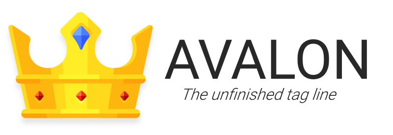

A W.I.P university project by <a href="https://themgrf.me">Thomas Griffiths</a>.

## Software
* [Java](https://adoptopenjdk.net/?variant=openjdk14) - This project makes use of Java and requires Java 14+ for its new record features

* [IntelliJ](https://www.jetbrains.com/idea/) - A modern Java IDE for the 21st century offering blazingly fast performance and an improved, intelligent experience.

* [Git BASH](https://gitforwindows.org/) - Git BASH provides a lightweight BASH emulation used to run Git from the command line on windows.

* [Maven](https://maven.apache.org/) - Apache Maven is a software project management and comprehension tool based on the project object model (POM) to build projects and manage dependencies.

* [OpenGL](https://www.opengl.org/) - OpenGL is a cross-language, cross-platform application programming interface for rendering 2D and 3D vector graphics.

* [JLWGL](https://www.lwjgl.org/) - The Lightweight Java Game Library is an open-source Java software library for video game developers.